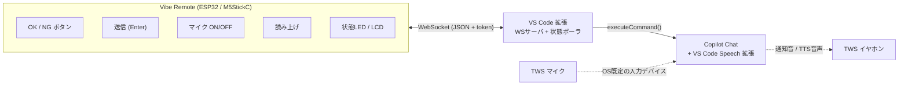

# Vibe Remote — プロジェクト引き継ぎ資料

> この資料は、Vibe Remote プロジェクトを別のAIエージェント／開発環境に引き継ぐためのものです。
> **経緯・ビジョン・課題と解決方法・技術的発見・意思決定の理由・現状・次の一手** を、
> 文脈ゼロの読み手でも追えるようにまとめています。
>
> 関連資料：
> - ビジュアル版コンセプト資料: [vibe-remote-concept.html](./vibe-remote-concept.html)
> - 実装コード: [`../vibe-remote/`](../vibe-remote/)（VS Code拡張）
> - 最終更新: 2026-06-14

---

## 0. 30秒サマリー

**Vibe Remote** は、AIコーディング（VS Code + Copilot Chat 等）を **PCの前に座らずに監督する** ための仕組み。

- AIエージェントは作業中に頻繁に「OK / NG」を求めてくる。そのたびにPCへ戻るのが煩わしい。
- 手元の **小さな物理デバイス（ESP32 / M5StickC PLUS2）** のボタンで OK/NG・送信・マイク・読み上げを操作する。
- PC側の **VS Code拡張** が WebSocketサーバになり、デバイスからの操作を **公式コマンド** に中継。作業状態をデバイスへ配信。
- 将来は **BugC2ロボ** が「承認待ちになると動いて知らせる」物理通知デバイスにも発展。
- 上位プロジェクト **GaplessAgentRuntime**（家のプロジェクト）の「離れた場所から監督する物理コックピット」という位置づけ。

**現状：VS Code拡張のコア実装が完了（ビルド・型チェック通過）。ただしF5での実動作確認は未。実機は未入手（長期出張中のため）。**

---

## 1. 経緯（どういう会話から生まれたか）

時系列での思考の流れ。意思決定の「なぜ」を残すための節。

1. **発端**：「AIコーディングを効率よくやりたい。PCの前に座らなくても、BTマウス程度の距離からOK/NGや指示出しをしたい」
2. **方式の検討**：当初はスマホ／チャットBot／Remote Tunnels等を比較したが、本人の要望は「**携帯ではなく簡単な物理デバイス（ESP32）**」「**VS Codeプラグインがサーバのように振る舞い、VS Codeと情報をやり取りする**」だった。
3. **要件の追加**：
   - マイクのON/OFFとEnterもデバイスから行いたい（マイクはTWS経路でよい）
   - 可能ならAIの確認内容をTTSで読み上げてほしい
4. **検知方式の割り切り**：「リアルタイム検知は既存の通知音でよい。あとは定期ポーリングでVS Codeの状態をLEDに反映できれば申し分ない」
5. **ビジュアル資料作成** → GPT Imageで製品イメージ生成 → 「このデバイス欲しい」となり実装へ。
6. **ハード選定の紆余曲折**：M5StickC PLUS2（約5,000円）が高い → 各種比較 → 「ロボットもやりたい」となり **M5Stack BugC2（StickC PLUS2同梱、¥7,480）** に着地。「通知が来たらロボットが動き出す」という遊び心も追加ビジョンに。
7. **VS Code拡張の実装** → コア完成・ビルド通過。
8. **検証手段の議論**：Renodeでの検証を検討したが、Wi-Fi/WebSocketが主役のため現時点では不向きと判断。仮想リモコン（WebView）が実質エミュレータとして機能する。
9. **GaplessAgentRuntime との関係が判明**：本人が家で開発中の [GaplessAgentRuntime](https://github.com/ThousandsOfTies/GaplessAgentRuntime) の文脈で、Vibe Remote はその「物理コックピット」と位置づけられる。
10. **現状**：長期出張中で実機・母艦環境にアクセスできないため、この引き継ぎ資料を作成。

---

## 2. ビジョン（課題と解決方法）

### 解きたい課題

- AIエージェントは作業の途中で頻繁に **「OK / NG」** を求めてくる。
- そのたびにPCの前に戻ってマウス・キーボードを触るのは煩わしい。
- でも本質的にユーザーがやることは **承認・却下・少しの指示出し** だけ。これは **物理ボタン数個で足りる**。

### 体験の理想形

- ソファや少し離れた席から、TWSで通知音を聞き、手元の小さなデバイスで **OK / NG** を返す。
- 必要なら **マイクをON** にして口頭で追加指示、**Enter** で送信。
- AIの応答は **読み上げ（TTS）** で耳から把握する。

### 設計思想（重要な割り切り）

| 項目 | 方針 | 理由 |
|---|---|---|
| リアルタイムの「呼び出し検知」 | **既存の通知音に任せる** | 拡張から承認待ちを正確に検知する公式APIが無いため |
| デバイスのLED/画面 | **定期ポーリングで"ざっくり状態表示"** | 活動ヒューリスティックで十分。壊れやすいログ監視を避ける |
| 操作（OK/NG/送信/マイク/読み上げ） | **すべて公式コマンドで確実に動く部分に集中** | proposed API非依存で堅牢 |

---

## 3. システム全体像



| コンポーネント | 役割 |
|---|---|
| **① ESP32 リモコン** | ボタン入力・LED/LCD表示・Wi-Fi常時接続。チャタリング除去と自動再接続。 |
| **② VS Code 拡張** | ローカルにWSサーバを立て、受けた操作を `executeCommand` で実行。状態を定期pushしてデバイス表示を制御。 |
| **③ Copilot + Speech** | 既存のまま。音声は **OS既定マイク = TWS** を使うので追加実装不要。 |

---

## 4. 技術的発見（最重要・再利用価値が高い）

### 4.1 操作 → 公式コマンド対応表

すべて VS Code の **正式なコマンドID**（proposed API 不要）。拡張から `vscode.commands.executeCommand()` で呼ぶだけ。
これらは VS Code 本体のソース調査で確認済み。

| 操作 | コマンドID | 信頼性 |
|---|---|---|
| OK（ツール実行を承認） | `workbench.action.chat.acceptTool` | ◎ |
| NG（スキップ） | `workbench.action.chat.skipTool` | ◎ |
| 編集を全受け入れ | `chatEditing.acceptAllFiles` | ◎ |
| 送信 (Enter) | `workbench.action.chat.submit` | ◎ |
| マイク ON | `workbench.action.chat.startVoiceChat` | ◎ |
| マイク OFF | `workbench.action.chat.stopListening` | ◎ |
| マイク OFF + 送信 | `workbench.action.chat.stopListeningAndSubmit` | ◎ |
| 応答を読み上げ (TTS) | `workbench.action.chat.readChatResponseAloud` | ○ |
| 読み上げ停止 | `workbench.action.speech.stopReadAloud` | ◎ |

- **音声入力の前提**：`startVoiceChat` は **VS Code Speech 拡張**（`ms-vscode.vscode-speech`）が必要。マイクは **OSの既定入力デバイス** を使うため、TWSを既定マイクに設定すればそのまま音声が通る。
- **TTSの制約**：「確認ダイアログの文面だけ」を読む公式APIは無い。`readChatResponseAloud` は **応答全体** を読み上げる。v1はこれで割り切る。

### 4.2 状態として「確実に取れる／取れない」情報

表示の主役は「承認内容」ではなく **"作業の実況"**。特に **ターミナルのシェル統合API** で、AIが実行したコマンドと成功/失敗がリアルに取れるのが最大の収穫。

**✅ 確実に取れる（公式の安定API）**

| 情報 | API | 表示例 |
|---|---|---|
| 実行中ターミナルコマンド | `window.onDidStartTerminalShellExecution` | `▶ npm test` |
| コマンド終了＋結果 | `window.onDidEndTerminalShellExecution`（exitCode付） | `✓ exit 0` / `✗ exit 1` |
| エラー / 警告の数 | `languages.getDiagnostics()` | `⚠ 3 errors` |
| 編集中ファイル名 | `window.activeTextEditor` | `parser.ts` |
| タスク実行中 | `tasks.onDidStartTask / onDidEndTask` | `▶ build` |
| デバッグ実行中 | `debug.onDidStartDebugSession` | `🐞 debugging` |
| ウィンドウのフォーカス | `window.state.focused` | 在席 / 離席 |
| Gitブランチ / 変更数 | Git拡張API | `main · 5 changed` |

**🟡 推定でしか取れない**：AIが作業中か（編集/出力の有無）／待ちかも（活動停止N秒、完了と区別不可）

**❌ 取れない（公式APIなし）**：承認内容の文面（"OK to apply patch?"等）／承認待ちの正確な判定（→通知音に委ねる）／AI応答テキストの取得（読み上げ以外）

---

## 5. 通信プロトコル（WebSocket / JSON）

**デバイス → 拡張（操作）**
```jsonc
{ "type":"action", "value":"ok",        "token":"…" }  // acceptTool
{ "type":"action", "value":"ng",        "token":"…" }  // skipTool
{ "type":"action", "value":"acceptAll", "token":"…" }  // 編集全受け入れ
{ "type":"action", "value":"submit",    "token":"…" }  // 送信
{ "type":"action", "value":"micToggle", "token":"…" }  // マイクON/OFF切替
{ "type":"action", "value":"readAloud", "token":"…" }  // 読み上げ
{ "type":"action", "value":"stopRead",  "token":"…" }  // 読み上げ停止
{ "type":"ping",   "token":"…" }
```

**拡張 → デバイス（状態 / 表示制御）**
```jsonc
{
  "type":"state",
  "chat":"working|maybeWaiting|idle",
  "mic":"on|off",
  "tts":"on|off",
  "activity": {
    "command":"npm test", "exitCode":1, "errors":3, "warnings":0,
    "file":"parser.ts", "debugging":false, "taskRunning":false, "focused":true
  },
  "ts": 1234567890
}
{ "type":"ack", "ok":true, "value":"ok" }
```

- 変化時にpush（即応）＋ ポーリング間隔（既定1秒）でも再評価。
- **全 action メッセージに共有トークンを必須化**。不一致は拒否。

---

## 6. セキュリティ要件

WSサーバは「Copilotの操作を実行できる」高権限のため、必ず対策する（OWASP的観点）。

- **共有トークン**：拡張起動時に生成し SecretStorage に保存。全操作に添付、不一致は拒否。ハードコード禁止。
- **バインド範囲**：既定 `127.0.0.1`（仮想リモコン用）。実機接続時のみ `0.0.0.0`（LAN公開）。
- **トークンはコードに埋め込まない**。設定／Secret経由で渡す。

---

## 7. 実装の現状（VS Code拡張）

場所：[`../vibe-remote/`](../vibe-remote/)

```
vibe-remote/
├── package.json          拡張定義・設定・コマンド
├── esbuild.js            バンドル設定
├── tsconfig.json
├── src/
│   ├── extension.ts      起動・トークン生成・ステータスバー・コマンド登録
│   ├── server.ts         WebSocketサーバ＋トークン認証＋状態配信
│   ├── commands.ts       操作→公式コマンドID中継（micToggleの状態切替含む）
│   ├── stateMonitor.ts   作業状態の観測（公式APIのみ使用）
│   ├── protocol.ts       メッセージ型定義
│   └── webview.ts        仮想リモコンUI（LCD風実況表示＋全ボタン）
└── .vscode/              F5デバッグ起動設定
```

### 実装済み機能

- WebSocketサーバ（既定 `127.0.0.1:39271`）＋ トークン認証（自動生成・SecretStorage保存）
- 操作中継：OK / NG / 送信 / マイクON/OFF / 全受け入れ / 読み上げ / 停止 → すべて §4.1 の公式コマンドへ
- 状態配信：1秒ポーリングで `working / maybeWaiting / idle` ＋ 実況（コマンド・終了コード・エラー数・編集ファイル・デバッグ/タスク状態）を配信
- 仮想リモコン（WebView）：**デバイス到着前に全機能を検証できる**。LCD風の実況表示＋全ボタン付き
- 設定：port / bindAddress / idleThresholdMs / pollIntervalMs

### 設定（package.json contributes.configuration）

| 設定キー | 既定 | 説明 |
|---|---|---|
| `vibeRemote.port` | 39271 | WSサーバのポート |
| `vibeRemote.bindAddress` | 127.0.0.1 | `0.0.0.0`で実機/LAN公開 |
| `vibeRemote.idleThresholdMs` | 4000 | 無活動でmaybeWaitingと判定 |
| `vibeRemote.pollIntervalMs` | 1000 | 状態再評価・配信間隔 |

### コマンド

- `vibeRemote.openVirtualRemote` — 仮想リモコンを開く（ステータスバー `📡 Vibe` からも）
- `vibeRemote.showToken` — 接続トークンを表示
- `vibeRemote.restartServer` — サーバ再起動

### ビルド／実行

```powershell
cd vibe-remote
npm install
npm run compile      # esbuildでdist/extension.jsを生成
# VS Codeでvibe-remoteフォルダを開き、F5（拡張を実行）
# → コマンドパレット「Vibe Remote: 仮想リモコンを開く」
```

---

## 8. 完了 / 未完了

### ✅ 完了

- VS Code拡張のコア（WSサーバ＋トークン認証＋コマンド中継＋状態ポーラ＋仮想リモコン）
- ビルド・型チェック通過
- ビジュアルコンセプト資料（HTML）
- 公式コマンドIDの調査・確定
- ハードウェア選定（M5Stack BugC2 = StickC PLUS2同梱）

### ⚠️ 未検証 / ❌ 未着手

| 項目 | 状態 | 備考 |
|---|---|---|
| **F5での実動作確認** | 未 | 仮想リモコンを押してCopilotが反応するか。最優先。 |
| ESP32ファームウェア（M5StickC側） | 未着手 | 実機未入手のため。コードは先行作成可能。 |
| BugC2ロボ連携（承認待ちで動く） | 未着手 | プロトコルは同じ`state`を受けるだけ。 |
| `micToggle`のマイク状態推定の精度 | 暫定 | 実体を観測できず送信履歴から推定。 |
| README / セットアップ手順 | なし | |
| アイコン・パッケージング（.vsix） | なし | |

---

## 9. ハードウェア

- **確定**：M5Stack BugC2（¥7,480、StickC PLUS2同梱、在庫処分価格）。ロボットでも遊べて、StickC PLUS2をVibe Remoteの頭脳に流用できる一石二鳥。
- StickC PLUS2 仕様：ESP32-PICO、1.14インチLCD、スピーカー、LED、Wi-Fi/BLE、200mAhバッテリ内蔵。
- **ボタンが少ない**（本体2〜3個）課題：OK/NG/送信/マイクは「短押し＋長押し＋画面メニュー」で割り当て。物理的に増やすなら DualButton Unit 等。
- 検証は **仮想リモコンが実質エミュレータ**。Renodeは Wi-Fi/WebSocket が主役の本件には現時点で不向き。

---

## 10. GaplessAgentRuntime との関係

- [GaplessAgentRuntime](https://github.com/ThousandsOfTies/GaplessAgentRuntime)（家のプロジェクト）は「**AIが切れ目なくコーディング→VM試験→実機試験をやり切るコックピット**」。
- 特徴：VM(EC2 Graviton)と実機(RasPi5)の**バイナリ透過性**、`/dev/*`互換runtime（CUSE/gpio-sim）、`gar sim ui button press` 等の仮想H/W操作API。
- **Vibe Remote の位置づけ**：GaplessAgentRuntimeを「**離れた場所から監督する物理コックピット**」。GaplessAgentRuntimeが基盤、Vibe RemoteがそこにOK/NGを返す物理デバイス。
- **統合の方向性（将来）**：
  1. Vibe Remote拡張を GaplessAgentRuntime の作法（`gar` CLI連携、docs構成、`#ifdef`不要の透過設計）に寄せる
  2. ESP32ファームを `gar sim` 思想の拡張として Renode等で検証する道
  3. 拡張が `gar` の状態を読む／操作する繋ぎこみ

---

## 11. 次の一手（推奨順）

今この環境（PC1台、実機なし）で完結できるもの：

1. **F5動作確認** — 仮想リモコンで全機能を実証。実機ゼロでOK。最も達成感があり「本当に動く」証拠になる。
2. **ESP32モック＋プロトコルtest** — Nodeで同じJSONを喋るスクリプトでサーバを叩く。ファーム実装前にプロトコル確定、帰宅後の手戻り防止。
3. **ESP32ファームを書いておく** — 焼くのは帰宅後。到着後すぐ動く状態に。
4. **README整備** — セットアップ手順を残す。
5. **GaplessAgentRuntime統合設計** — docs作法に寄せた設計メモ。

帰宅後（実機あり）：
- M5StickC PLUS2にファーム書き込み → Wi-Fi接続 → 実機でOK/NG。
- BugC2ロボで「承認待ちに動いて知らせる」演出。

---

## 12. 引き継ぎ先AIへの依頼テンプレート

> 私は Vibe Remote プロジェクトを引き継ぎます。この資料（`docs/PROJECT_HANDOFF.md`）と
> `vibe-remote/` の実装、`docs/vibe-remote-concept.html` を読んで文脈を把握してください。
> 現状は「VS Code拡張のコア完成・F5動作未確認・実機未入手」です。
> まずは §11 の「次の一手」から、今の環境でできることを提案してください。
> 設計の割り切り（§2 設計思想、§4 取れる/取れない情報）を尊重し、
> proposed API に依存しない方針を維持してください。
